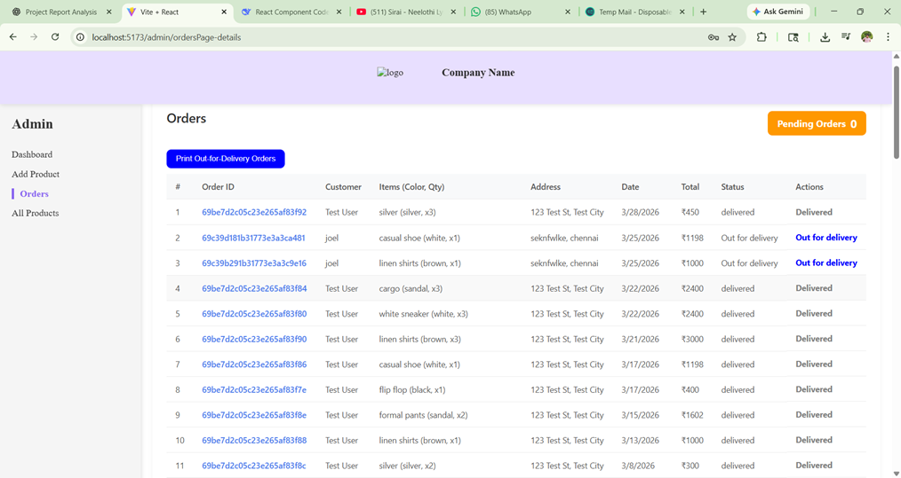

# Fashion Hub 🛍️

Fashion Hub is a modern, full-stack e-commerce web application developed using the MERN stack (MongoDB, Express.js, React.js, Node.js). It provides a seamless and user-friendly online shopping experience, allowing customers to browse, select, and purchase clothing products efficiently.

## 🚀 Features

### 🛒 Customer Features

- **Secure Authentication:** OTP-based registration and JWT authentication.
- **Smart Search:** AI-powered semantic search using vector embeddings for better product discovery.
- **Dynamic Browsing:** Browse products with multiple color and size variants.
- **Cart & Wishlist:** Persistent shopping cart with automatic expiry and a personalized wishlist.
- **Order Tracking:** Real-time order tracking and history.

### 🛡️ Admin & Sales Features _(Restricted Access)_

> **Note for Recruiters/Visitors:** Access to the Admin and Sales Representative dashboards is restricted to authorized personnel only. Below are screenshots of these internal tools.

- **Interactive Dashboard:** Sales analytics and insights.
- **Product Management:** Comprehensive CRUD operations with multi-image upload and variant-level inventory tracking.
- **Order Lifecycle Management:** Complete order processing from pending to delivery/cancellation.

---

## 📸 Internal Tools Showcase

Since the Admin and Sales panels are restricted on the live site, here is a preview of the internal dashboards:

### 1. Admin Dashboard

Provides an overview of system performance, including total orders, revenue, and product statistics.


### 2. Order Management & Sales Rep View

Allows sales representatives and admins to view and manage all customer orders, update statuses, and handle cancellations.

---

## 🛠️ Tech Stack

- **Frontend:** React.js, Vite, Ant Design, React Router DOM, Redux Toolkit
- **Backend:** Node.js, Express.js
- **Database:** MongoDB Atlas (with Atlas Vector Search)
- **Services:** Cloudinary (Image Storage), Nodemailer (Email/OTP), @xenova/transformers (AI Embeddings)

## ⚙️ How to Run Locally

### Backend Setup

```bash
cd server
npm install
npm run dev
```

_(Runs on port 5000)_

### Frontend Setup

```bash
cd client
npm install
npm run dev
```

_(Runs on port 5173)_
